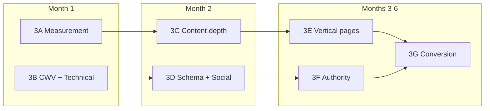

# CliniqFlow SEO Phase 3+ Plan — From Foundation to Category Leadership

**Status:** Planning (post Phase 1 & 2, commit `da81488`)  
**Canonical domain:** `https://cliniqflow.app`  
**North star:** Qualified clinic-intent organic visitors who **Sign up** — not vanity traffic or thin rankings.

**Related docs:** [SEO_STRATEGY.md](./SEO_STRATEGY.md) · [SEO_KEYWORDS.md](./SEO_KEYWORDS.md) · [CONTENT_MAP.md](./CONTENT_MAP.md) · [MARKETING_NOT_TO_DO_MANUSCRIPT.md](./MARKETING_NOT_TO_DO_MANUSCRIPT.md)

---

## What Phase 1 & 2 gave us (baseline)

| Layer | Done |
|-------|------|
| Technical | `robots.txt`, `sitemap.xml`, canonical URLs, OG/Twitter, JSON-LD |
| On-page | Homepage + 5 landing pages, header/footer internal links |
| Compliance | Sign up only CTA, noindex auth/intake, workflow-layer positioning |
| Docs | Keyword map, content map, strategy |

**Gap today:** No search analytics loop, no CWV optimization pass, no content depth beyond ~900 words/page, no authority (backlinks), no vertical/niche pages, no conversion instrumentation for organic traffic.

---

## Guiding principles (non-negotiable)

1. **Human-reviewed content only** — no agentic auto-publishing, no AI blog farms.
2. **Compliance first** — every new page passes `MARKETING_NOT_TO_DO_MANUSCRIPT.md` before publish.
3. **Quality over volume** — 3 excellent pages beat 30 thin ones.
4. **Product truth** — only claim what exists in code (niches, workflows, Razorpay billing, draft-then-approve AI).
5. **Single CTA** — **Sign up** → `/signup` on all marketing pages.

### Explicitly out of scope

- Competitor “vs” attack pages
- Programmatic city/local pages (`/clinics-in-mumbai`)
- Fake reviews, star ratings, or certification badges
- Indexing `/signup` or patient intake URLs
- Keyword stuffing or EHR/telehealth/diagnostic positioning

---

## Phase 3 roadmap overview

| Phase | Focus | Timeline | Primary outcome |
|-------|--------|----------|-----------------|
| **3A** | Measurement & GSC loop | Weeks 1–2 | Know what's indexed, ranking, and converting |
| **3B** | Core Web Vitals & technical polish | Weeks 2–4 | Faster LCP, cleaner crawl, better social CTR |
| **3C** | Content depth & guides | Weeks 4–8 | Topical authority on intake + documentation |
| **3D** | Schema, OG, and share assets | Weeks 6–8 | Rich results eligibility + linkable assets |
| **3E** | Niche vertical landing pages | Months 2–4 | Long-tail specialty traffic |
| **3F** | Authority & distribution | Months 3–6 | Backlinks from directories, partners, content |
| **3G** | Conversion optimization | Ongoing | Organic → signup rate improvement |

---

## Phase 3A — Measurement & feedback loop

**Goal:** Replace guessing with a weekly SEO ritual.

### 3A.1 Google Search Console (required)

- [ ] Verify `https://cliniqflow.app` property (DNS preferred)
- [ ] Submit `https://cliniqflow.app/sitemap.xml`
- [ ] Baseline export: indexed pages, coverage errors, Core Web Vitals
- [ ] Set up email alerts for coverage drops

### 3A.2 Privacy-respecting analytics

Cookie policy states no advertising or third-party marketing analytics cookies. Options that fit:

| Option | Pros | Cons |
|--------|------|------|
| **Vercel Web Analytics** | No cookies, easy on Next.js | Limited SEO query data |
| **Plausible / Fathom** | Privacy-first, lightweight | Paid; update Cookie Policy if needed |
| **Server-side events** | Full control, no client cookies | Build `POST /api/events` + Supabase table |

**Minimum events to track:**

| Event | Trigger | Segment |
|-------|---------|---------|
| `page_view` | Marketing route load | `utm_source`, `referrer` |
| `cta_signup_click` | Sign up button | Page path |
| `signup_complete` | Successful account creation | Organic vs paid vs direct |

**Deliverable:** `docs/SEO_ANALYTICS.md` + optional `src/lib/analytics/` module.

### 3A.3 Query → page mapping (monthly)

Maintain a spreadsheet (or Notion) with columns:

- Query (from GSC)
- Impressions / clicks / CTR / position
- Target URL
- Action (expand page, new guide, no action)

**Rule:** If a query gets 50+ impressions/month and avg position 8–20, prioritize content on the mapped landing page.

### 3A.4 Weekly SEO standup (15 min)

1. GSC performance (last 7 vs prior 7 days)
2. New indexing issues
3. Top 5 queries by impressions
4. One content or technical action for the week

---

## Phase 3B — Core Web Vitals & technical polish

**Goal:** Pass CWV on marketing pages; eliminate crawl waste.

### 3B.1 Performance targets

| Metric | Target (mobile) | Primary pages |
|--------|-----------------|---------------|
| LCP | &lt; 2.5s | `/`, landing pages |
| INP | &lt; 200ms | All marketing |
| CLS | &lt; 0.1 | Homepage previews |

### 3B.2 Implementation checklist

- [ ] Audit homepage hero/preview images — explicit `sizes`, `priority` only on LCP image
- [ ] Lazy-load below-fold product previews (`loading="lazy"`)
- [ ] Defer non-critical client JS on homepage (pricing actions if possible)
- [ ] Confirm OG image &lt; 200KB; add **per-page OG images** for 5 landing pages (better LinkedIn CTR)
- [ ] Add `lastmod` per route in sitemap (file mtime or git date) instead of single `new Date()`
- [ ] Redirect legacy routes `/dashboard`, `/patients` → `/app/dashboard`, `/app/patients` (301)
- [ ] Add `link rel="preconnect"` for font origins if LCP tied to fonts

### 3B.3 Crawl hygiene

- [ ] Confirm `/proof/*` stays noindex (sales demos)
- [ ] Audit internal links for broken anchors on inner marketing pages
- [ ] Add `404` helpful links back to Product pages

**Files likely touched:** `homepage-product-previews.tsx`, `sitemap.ts`, `next.config.ts` (redirects), `public/og/`.

---

## Phase 3C — Content depth & topical authority

**Goal:** Win long-tail queries Phase 1–2 pages only introduce.

### 3C.1 Expand existing landing pages (priority order)

| Page | Additions | Target queries |
|------|-----------|----------------|
| `/how-patient-intake-works` | Step-by-step workflow diagram, “intake vs EHR charting” educational section (no competitor names) | digital patient intake, patient onboarding software |
| `/ai-documentation` | Practitioner review workflow, draft/approve screenshots, link to `/ai-disclaimer` | AI-assisted clinical documentation, AI SOAP note assistant (careful phrasing) |
| `/clinic-workflows` | Team roles section (front desk → practitioner), status queue explanation | clinic documentation workflow |
| `/security` | Data flow diagram (patient → tenant isolation), subprocessors summary | clinic data security |
| `/faq` | 6 → 12 questions from sales calls (compliance-reviewed) | informational cluster |

**Target length:** 1,200–1,800 words per landing page where it adds clarity — not padding.

### 3C.2 New guide hub (human-written, indexable)

Create `/guides` index + 3 cornerstone guides (not a blog — evergreen, counsel-reviewed):

| URL | Title direction | Primary keyword |
|-----|-----------------|-----------------|
| `/guides/structured-patient-intake` | How structured patient intake reduces visit friction | healthcare intake workflow |
| `/guides/ai-documentation-for-clinics` | AI-assisted documentation: draft, review, approve | AI-assisted clinical documentation |
| `/guides/intake-to-documentation-workflow` | Connecting intake data to documentation drafts | intake and documentation software |

**Implementation pattern:**

- Reuse `MarketingPageShell`
- Add to `SITEMAP_ENTRIES` and `SEO_LANDING_PAGES` (or new `SEO_GUIDE_PAGES`)
- BreadcrumbList + FAQPage where applicable
- Cross-link from homepage workflow section and footer

### 3C.3 Content review workflow

Every new/expanded page:

1. Draft in Google Doc or MD
2. Check against `MARKETING_NOT_TO_DO_MANUSCRIPT.md` §3–§6
3. Legal/compliance sign-off for AI and medical claims
4. Publish → submit URL in GSC → monitor for 4 weeks

---

## Phase 3D — Schema, OG, and share assets

**Goal:** Maximize eligible rich results and social click-through.

### 3D.1 Schema enhancements

| Schema | Where | Notes |
|--------|-------|-------|
| `HowTo` | `/how-patient-intake-works`, `/guides/*` | Steps must match real product flow |
| `FAQPage` | Expanded `/faq`, guide pages | Verbatim approved copy only |
| `BreadcrumbList` | All guides + vertical pages | Extend `schema.ts` |
| `SoftwareApplication` | Keep on `/` and `/ai-documentation` | Update when pricing changes |
| ~~`Review` / `AggregateRating`~~ | **Do not add** | No fake social proof |

### 3D.2 Per-page Open Graph

| Asset | Size | Pages |
|-------|------|-------|
| `cliniqflow-og.png` | 1200×630 | Default (exists) |
| `og/intake-workflow.png` | 1200×630 | `/how-patient-intake-works` |
| `og/ai-documentation.png` | 1200×630 | `/ai-documentation` |
| `og/clinic-workflows.png` | 1200×630 | `/clinic-workflows` |
| `og/security.png` | 1200×630 | `/security` |

Pass `openGraph.images` override in `buildPageMetadata` per page.

### 3D.3 Linkable assets (for outreach)

- One-page PDF: “CliniqFlow workflow overview” (no outcome claims)
- Architecture diagram: intake → draft → practitioner approval
- Security one-pager linking to `/security-policy`

Host in `/public/resources/` — index the HTML landing page, not necessarily the PDF.

---

## Phase 3E — Niche vertical landing pages

**Goal:** Capture specialty long-tail without city spam.

Product supports real niches in `niche_configs.json`:

- `general_practice`
- `functional_medicine`
- `chiropractor`
- `aesthetic_clinic`
- `holistic`

### Proposed URLs

| URL | H1 direction | Compliance note |
|-----|--------------|-----------------|
| `/for/general-practice` | Intake and documentation workflows for general practice clinics | Workflow only; no clinical outcomes |
| `/for/functional-medicine` | Structured intake for functional medicine practices | Reference niche questionnaires exist |
| `/for/chiropractic` | Patient intake workflow for chiropractic clinics | No treatment claims |
| `/for/aesthetic-clinics` | Intake workflow for aesthetic clinics | No before/after or results |
| `/for/holistic-practices` | Documentation workflow for holistic practices | Practitioner review emphasis |

**Rules:**

- One H1, 600–900 words, 2–3 product screenshots from niche config
- Link up to `/how-patient-intake-works` and `/clinic-workflows`
- Add to sitemap at priority `0.7`
- **Do not** create geo variants (`/for/chiropractic-mumbai`)

**Implementation:** `src/app/for/[niche]/page.tsx` dynamic route with static generation for known niches, or 5 static pages.

---

## Phase 3F — Authority & distribution

**Goal:** Earn backlinks for competitive terms (difficulty 7–8 keywords).

### 3F.1 Directory & listing targets

| Type | Examples | Effort |
|------|----------|--------|
| SaaS directories | G2, Capterra, GetApp | Medium — needs profile + compliance review |
| Healthcare IT lists | Selective, accurate category only | Low–medium |
| Founder/company profiles | LinkedIn company, Product Hunt (launch) | One-time |
| Open-source / tech | GitHub org readme link to product | Low |

**Category to use:** “Patient intake software” / “Clinical documentation workflow” — **not** EHR.

### 3F.2 Content-led outreach (manual)

- Guest outline for practice-management newsletters (workflow tips, no AI hype)
- Partner clinics (with permission) — case study page `/customers/[slug]` when real quotes exist
- Respond to HARO/Quora **only** with approved messaging

### 3F.3 What not to do

- Buy links or use PBNs
- Spam comment links
- Auto-submit to 500 directories
- Publish on Medium/LinkedIn **instead of** canonical on-site content

### 3F.4 Backlink tracking

Monthly Ahrefs free / GSC Links report:

- Referring domains count
- Top linked page
- Anchor text diversity (brand + generic, not over-optimized)

**Target (6 months):** 15–30 referring domains from legitimate sources.

---

## Phase 3G — Conversion optimization for SEO traffic

**Goal:** Improve organic → signup rate (benchmark: 1–3% for B2B SaaS landing pages).

### 3G.1 On-page tests (sequential, not simultaneous)

| Test | Hypothesis | Measure |
|------|------------|---------|
| Hero CTA copy | “Sign up” vs “Create clinic workspace” | `cta_signup_click` rate |
| Above-fold trust line | Add security link near hero CTA | Signup completion |
| Landing page sticky CTA | Mobile bottom bar on long pages | Scroll depth → signup |

### 3G.2 Landing page entry paths

Ensure each landing page works as a **standalone entry** (user may never see homepage):

- H1 matches search intent in first 100 words
- Sign up CTA above fold and at bottom (already in `MarketingPageShell` — verify)
- One “what happens next” line after CTA (signup → subscribe flow)

### 3G.3 Signup page UX (stays noindex)

- Preserve `utm_*` params through signup flow for attribution
- Show referrer-appropriate headline when `?from=/ai-documentation`

---

## Keyword expansion map (Phase 3 targets)

| Keyword | Difficulty | Phase 3 action |
|---------|------------|----------------|
| digital patient intake | 5 | Expand `/how-patient-intake-works` |
| patient onboarding software for clinics | 4 | Guide + FAQ |
| AI SOAP note assistant | 7 | `/ai-documentation` + guide (strict compliance) |
| chiropractic intake software | 4 | `/for/chiropractic` |
| functional medicine intake form | 4 | `/for/functional-medicine` |
| aesthetic clinic patient intake | 4 | `/for/aesthetic-clinics` |
| workflow layer vs EHR | 3 | Guide (informational, no competitor names) |
| HIPAA safeguards intake software | 6 | Expand `/security` (no certification claims) |

Update [SEO_KEYWORDS.md](./SEO_KEYWORDS.md) when pages ship.

---

## Success metrics

### 30 days

| Metric | Target |
|--------|--------|
| GSC indexed pages | 19+ (current indexable set) |
| Coverage errors | 0 critical |
| Rich results valid | `/`, `/faq`, `/ai-documentation` |
| CWV | No “Poor” URLs in GSC |

### 90 days

| Metric | Target |
|--------|--------|
| Non-branded impressions | +50% vs baseline |
| Avg position (long-tail cluster) | Top 20 for 3+ queries |
| Organic signup sessions | Measurable baseline established |
| Referring domains | +5 |

### 6 months

| Metric | Target |
|--------|--------|
| Top 10 | 2–3 long-tail terms (difficulty ≤5) |
| Top 20 | 5+ terms |
| Organic signups | 5–15/month (realistic for niche B2B) |
| Referring domains | 15–30 |

---

## Implementation backlog (prioritized todos)

### P0 — Do first (Weeks 1–4)

- [ ] **gsc-setup** — Verify domain, submit sitemap, baseline report
- [ ] **analytics-events** — Privacy-respecting page views + CTA clicks
- [ ] **cwv-homepage** — LCP/image optimization pass
- [ ] **og-per-page** — 4 landing-page OG images
- [ ] **legacy-redirects** — `/dashboard`, `/patients` → `/app/*`
- [ ] **sitemap-lastmod** — Per-route lastModified

### P1 — Content (Weeks 4–10)

- [ ] **expand-intake-page** — Depth + HowTo schema
- [ ] **expand-ai-docs-page** — Review workflow section
- [ ] **expand-faq** — 6 new compliance-approved Q&As
- [ ] **guides-hub** — `/guides` index + 3 cornerstone guides
- [ ] **update-content-map** — Reflect new URLs

### P2 — Verticals (Weeks 8–14)

- [ ] **niche-pages** — 5 `/for/*` pages from `niche_configs.json`
- [ ] **niche-sitemap** — Add to routes + internal links from homepage

### P3 — Authority (Months 3–6)

- [ ] **directory-profiles** — G2/Capterra accurate listings
- [ ] **workflow-pdf** — Downloadable overview for outreach
- [ ] **first-case-study** — When customer permission exists

### P4 — Conversion (Ongoing)

- [ ] **utm-preservation** — Signup attribution
- [ ] **landing-entry-ux** — Standalone entry polish per page
- [ ] **monthly-query-review** — GSC → content actions

---

## Files to create (estimate)

| File | Purpose |
|------|---------|
| `docs/SEO_ANALYTICS.md` | Event schema + tool choice |
| `docs/SEO_PHASE_3_PLAN.md` | This document |
| `src/lib/analytics/marketing.ts` | Server or client event helpers |
| `src/app/guides/page.tsx` | Guide hub |
| `src/app/guides/[slug]/page.tsx` | Guide template |
| `src/app/for/[niche]/page.tsx` | Vertical landing pages |
| `public/og/*.png` | Per-page social images |
| `public/resources/` | PDFs and diagrams |

## Files to modify

| File | Change |
|------|--------|
| `src/lib/seo/routes.ts` | Guides + vertical routes in sitemap |
| `src/lib/seo/schema.ts` | HowTo builder |
| `src/lib/seo/metadata.ts` | Per-page OG override helper |
| `src/components/layout/footer.tsx` | Guides + For links |
| `next.config.ts` | Legacy redirects |
| `docs/SEO_STRATEGY.md` | Link to Phase 3 |
| `docs/CONTENT_MAP.md` | New URLs |
| `build.txt` | Changelog per shipped phase |

---

## Recommended execution order

**Sprint 1 (2 weeks):** 3A + 3B P0 items — measure and speed up.  
**Sprint 2 (2 weeks):** Expand 2 landing pages + FAQ + per-page OG.  
**Sprint 3 (3 weeks):** Guides hub (3 pages) + HowTo schema.  
**Sprint 4 (3 weeks):** 5 niche vertical pages.  
**Ongoing:** 3F outreach 2–4 hours/week, 3G conversion tweaks monthly.

---

## Decision log (record choices here)

| Date | Decision | Rationale |
|------|----------|-----------|
| 2026-06-05 | No agentic SEO / auto-publishing | Compliance + quality |
| 2026-06-05 | Sign up only CTA | User preference |
| TBD | Analytics vendor | Must align with Cookie Policy |
| TBD | First niche page to ship | Pick highest demo volume niche |

---

*When ready to implement, create a Cursor plan from the P0 backlog and ship Sprint 1 before writing new indexable content.*
